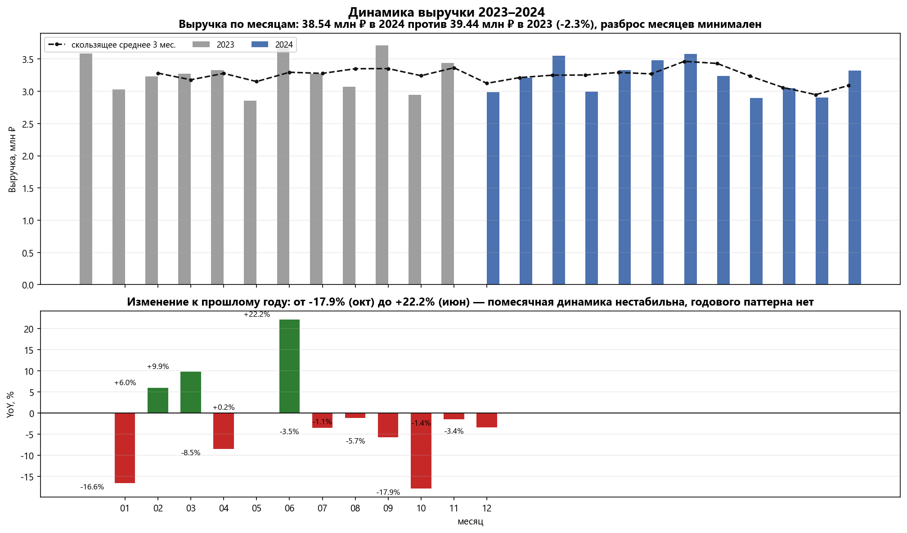
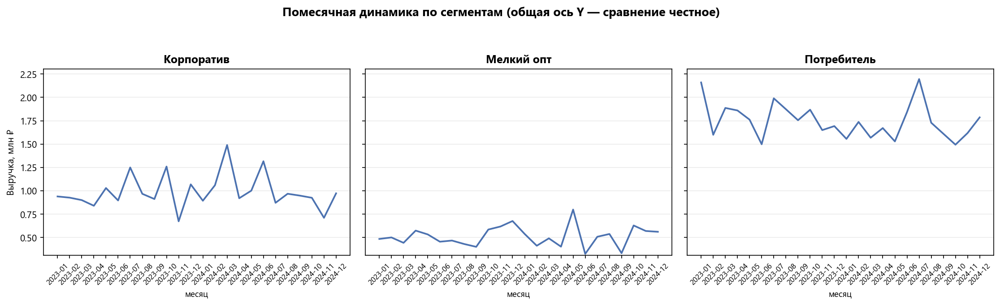
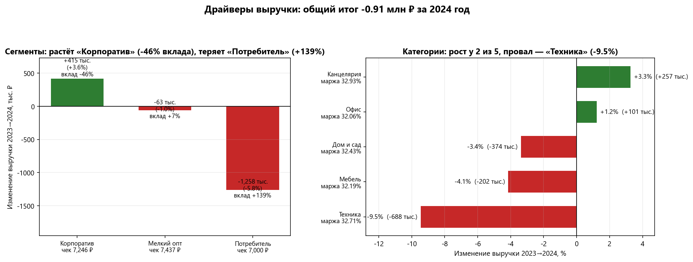
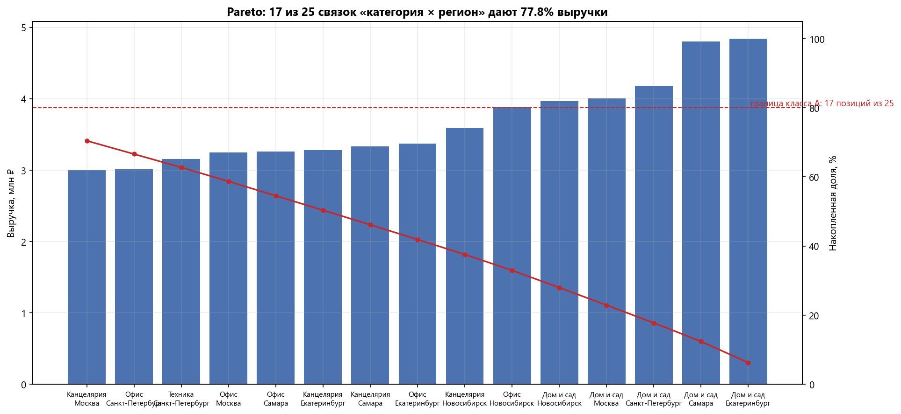
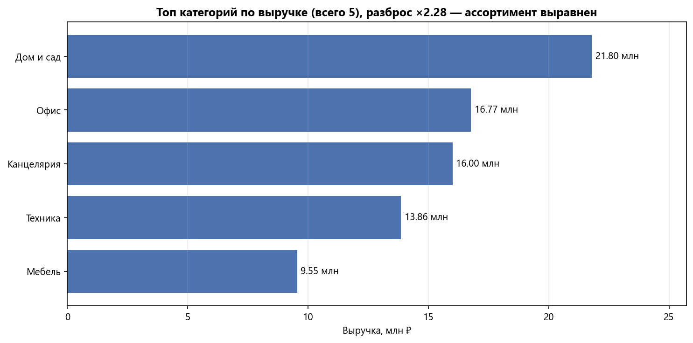
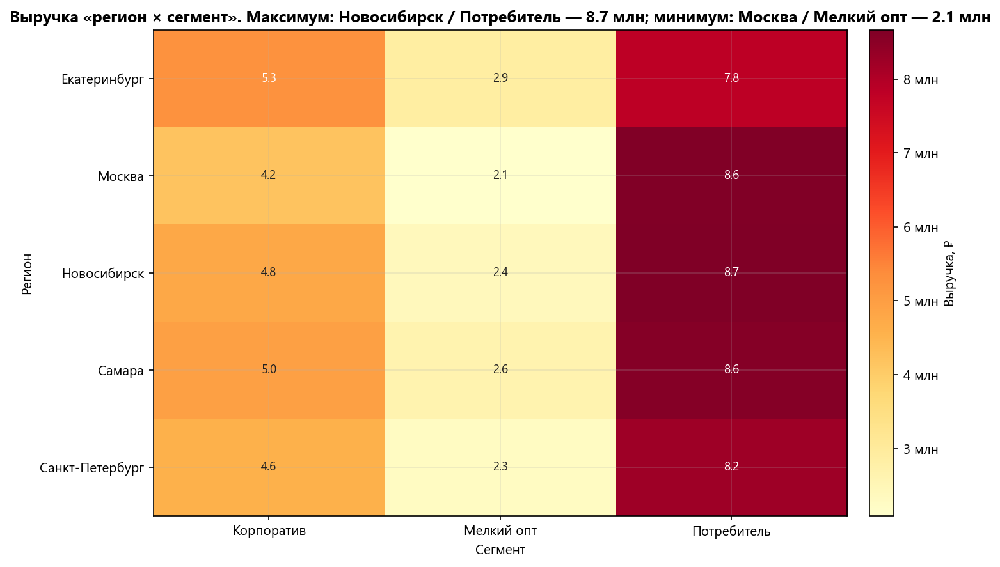
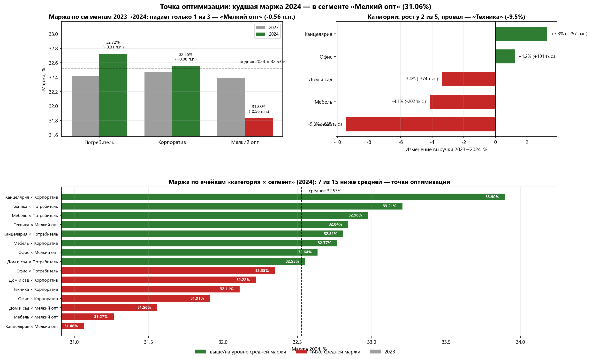
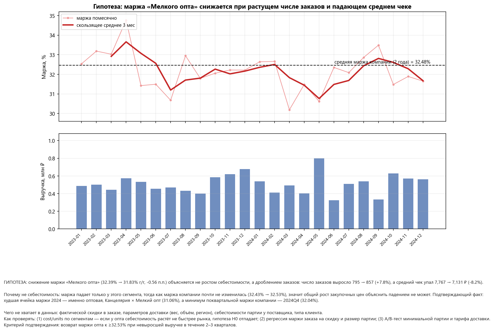
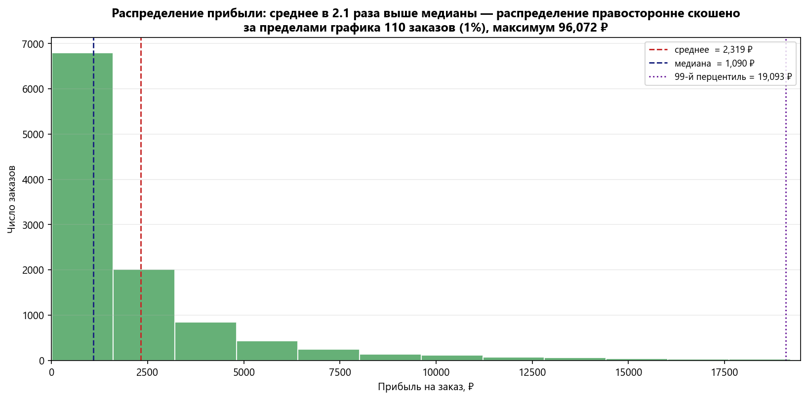

# Анализ продаж 2023–2024 (pandas)

Портфольный кейс BI-аналитика: уборка и анализ продаж интернет-магазина
на Python (pandas + matplotlib). Все расчёты воспроизводимы, все выводы
опираются на числа из кода.

**Данные:** `data/sales_2023_2024.csv` — 11 000 записей за 2023–2024,
5 категорий × 5 регионов × 3 сегмента.

---

## Как запустить

```bash
git clone https://github.com/vladimiryakimov91-art/sales_analysis.git
cd sales_analysis
pip install -r requirements.txt
jupyter notebook 01_sales_analysis.ipynb
```

Пути в ноутбуке относительные (`Path.cwd()`), поэтому он запускается из любой папки.
Графики собираются в `output/` при выполнении ячеек.

Версии, на которых проверено: Python 3.14, pandas 2.3.3, numpy, matplotlib 3.10.8.

---

## Что внутри

| Шаг | Содержание |
|---|---|
| 0 | Загрузка CSV, типы данных, производные колонки `year` / `quarter` / `month` |
| 1 | Уборка данных: классификация дефектов, восстановление, контроль качества |
| 2 | KPI по месяцам, топ категорий, сводная «регион × сегмент», год к году, ABC, вклад в прирост |
| 3 | Девять графиков, у каждого один вопрос и один вывод |
| 4 | Выводы для бизнеса |

---

## Главное: уборка данных

В данных **три разных типа дефектов**, и важно, что они требуют разных решений.

| Дефект | Признак | Строк | Решение |
|---|---|---|---|
| Пропуск | `units = NaN` | 165 | заполнить медианой (медиана = 9.0) |
| Заглушка | `revenue = −1`, `cost` и `profit` валидны | 110 | **восстановить** |
| Пустой заказ | `revenue = cost = profit = 0` | 79 | **исключить** из KPI |
| Дубли | `duplicated()` / `order_id` | 0 | — |

### Почему `revenue = −1` — это не возврат

Первая гипотеза «это возвраты» **не подтверждается**:

* при возврате отрицательными должны быть `revenue`, `cost` и количество — но `cost`
  положителен, а `profit` положителен и **не равна** `revenue − cost`;
* у всех «грязных» строк значение ровно одно: `−1.0` (сумма `−110.00` = `−1 × 110`).

Единичное значение `−1` — это **заглушка (sentinel)**, а не бизнес-событие.
Значение восстанавливается однозначно, что проверяется двумя независимыми
формулами, дающими одинаковый результат до копейки:

```
revenue = units × price      и      revenue = cost + profit
макс. расхождение = 0.000000
```

В коде используется `cost + profit`, потому что эта формула **не зависит от `units`** —
и это решает вопрос порядка операций: одна строка имеет **и** пропуск в `units`,
**и** заглушку в `revenue`. Если заполнить `units` медианой **до** восстановления
выручки из `units × price`, эта строка посчиталась бы от медианного количества
и сумма разошлась бы с эталоном на 1 380 ₽.

Стоимость ошибки: **≈ 687 тыс. ₽ выручки**, которые теряются, если просто удалить
строки или заполнить нулями.

### Почему пустые заказы исключаются

У этих строк `revenue = cost = profit = 0`, то есть данные **внутренне согласованы**
(`profit = revenue − cost` выполняется) — «чинить» нечего. Но продажа нулевого
количества единиц за ноль рублей — это не продажа, а отменённый заказ.

В выручку они дают ровно ноль, но попадают в знаменатель числа заказов и занижают
средний чек. Решение принимается явно, с расчётом чувствительности:

```
с пустыми: 77 976 295 ₽ / 11 000 = 7 088.75 ₽
без пустых: 77 976 295 ₽ / 10 921 = 7 140.03 ₽   → занижение 0.7%
```

### Контроль качества

После уборки — шесть проверок `assert`. Если хоть одна не проходит, пайплайн падает
сразу, а не отдаёт в отчётность испорченные цифры: неположительная выручка,
пропуски, `profit = revenue − cost`, уникальность `order_id`, сохранение числа строк,
положительные `revenue` и `units` в рабочем фрейме.

---

## Ключевые числа

| Метрика | Значение |
|---|---|
| Записей в файле | 11 000 |
| Фактических продаж в анализе | 10 921 |
| Выручка за 2 года | 77 976 295 ₽ |
| Средний чек | 7 140 ₽ |
| Средняя маржа | 32.48% (2023: 32.43% → 2024: 32.53%) |
| Выручка 2023 → 2024 | 39 441 184 → 38 535 111 ₽ (**−2.30%**) |
| Прибыль на заказ: среднее / медиана | 2 319 ₽ / 1 090 ₽ |

---

## Выводы

### 1. Драйвер: «Корпоратив» тащит, «Потребитель» тормозит

Общая выручка за 2024 год **снизилась** на 906 тыс. ₽ (−2.30%), при этом число заказов
выросло (5 437 → 5 484, +0.9%). Средний чек при этом просел с 7 254 до 7 027 ₽ (−3.1%).

| Сегмент | 2023 | 2024 | Изменение |
|---|---|---|---|
| Корпоратив | 11 668 549 | 12 084 011 | **+3.56%** (+415 тыс.) |
| Мелкий опт | 6 174 580 | 6 111 294 | −1.02% (−63 тыс.) |
| Потребитель | 21 598 055 | 20 339 806 | **−5.83%** (−1 258 тыс.) |

По категориям растут только две, причём **по-разному**:

* «Канцелярия» +3.26% — качественный рост: маржа 32.93%, выше средней;
* «Офис» +1.22% — рост вопреки марже (32.06%, ниже средней): оборот набирается
  объёмом, а не качеством, при ухудшении спроса просядет первым.

«Техника» −9.46% (−688 тыс.) — единственное двузначное падение, приоритет №1 для разбора.

### 2. Точка оптимизации: сегмент «Мелкий опт»

Маржа падает **только** у одного сегмента: 32.39% → 31.83% (−0.56 п.п.).
Маржа компании при этом стабильна, значит общий рост закупочных цен падение
объяснить не может. Подтверждение: три худшие ячейки маржи 2024 года — все оптовые,
худшая — «Канцелярия × Мелкий опт» (31.06%). Поквартальный минимум маржи компании —
2024Q4 (32.04%).

Гипотеза: падение вызвано дроблением заказов, а не закупочными ценами.
Проверяется расчётом `cost / units` по сегментам — роста себестоимости на единицу нет,
значит Н0 отпадает. В ноутбуке приведены нулевая гипотеза, недостающие данные,
методы проверки (регрессия маржи на скидку и размер партии, A/B-тест минимальной партии)
и критерий подтверждения.

### 3. Спрос стабилен, сезонности нет

Разброс помесячной выручки 2.85–3.71 млн ₽ (среднее 3.25 млн, ±13%), YoY колеблется
от −17.9% (октябрь) до +22.2% (июнь) без годового паттерна, скользящее среднее за
3 месяца падает на 5.8%. Практический вывод: сезонная модель закупок не нужна,
решения должны опираться на структуру «категория × сегмент × регион».

Отрицательный результат, сформулированный явно, снимает целый класс гипотез
до начала работы.

### 4. Распределение прибыли крайне скошено

Асимметрия 6.99: среднее 2 319 ₽ в **2.1 раза** выше медианы 1 090 ₽.
47.2% заказов дают меньше 1 000 ₽ прибыли и лишь 9.5% всей прибыли, максимум —
96 072 ₽. Следствие: **среднее прибыли на заказ не характеризует типичный заказ**,
для описания нужна медиана. Поэтому гистограмма обрезана по 99-му перцентилю,
а число заказов за границей указано явно.

### 5. ABC: по 5 категориям метод вырождается

| Классификация | A | B | C |
|---|---|---|---|
| По 5 категориям (факт) | 69.99% | 17.77% | 12.24% |
| Цель 80/15/5 | 80% | 15% | 5% |
| **По «категория × регион», 25 позиций** | **77.77%** (17) | **15.35%** (5) | **6.88%** (3) |

По 5 категориям «Мебель» с собственной долей 12.24% попадает в класс C —
артефакт малой выборки. Считается и по связкам «категория × регион» (25 позиций):
доли почти совпадают с целевыми, и 17 из 25 связок держат 77.8% выручки.
Зафиксирована конвенция: позиция идёт в класс, если накопленная доля на ней
не превышает порог.

---

## Графики

Девять графиков, у каждого один управленческий вопрос и один вывод.
Все подписи вычисляются кодом из данных.

### Стабилен ли спрос? Есть ли сезонность? — `dinamic.png`



Разброс 2.85–3.71 млн ₽ (±13%), YoY от −17.9% до +22.2% без годового паттерна,
скользящее среднее за 3 месяца −5.8%. Сезонной модели закупок не требуется.

### Как ведут себя сегменты помесячно? — `segments.png`



Ось Y общая: при раздельных осях графики показывали бы колебания шума
и скрывали разницу масштабов сегментов.

### Кто даёт прирост, кто его съедает? — `drivers.png`



«Потребитель» −1 258 тыс. ₽ перекрывает рост «Корпоратива» +415 тыс. ₽.
Проценты вкладов читаются только рядом со знаком итога: при отрицательном
итоге вклад инвертируется.

### Сколько позиций держат 80% выручки? — `abc.png`



По 5 категориям метод вырождается («Мебель» с долей 12.24% уходит в C).
По 25 связкам «категория × регион» доли почти совпадают с целью 80/15/5.

### Как выровнен ассортимент по масштабу? — `top_categories.png`



Растут только две категории, причём по-разному: «Канцелярия» +3.26% при марже
выше средней, «Офис» +1.22% при марже ниже средней — оборот объёмом, а не качеством.

### Где концентрация выручки? — `kart.png`



Разброс между лучшей и худшей ячейкой — 4.14 раза, при равномерном количестве
заказов. Читается как карта приоритетов, а не как таблица чисел.

### Где точка оптимизации по марже? — `marga.png`



Падение маржи — только у «Мелкого опта» (32.39% → 31.83%). Маржа компании стабильна,
значит общий рост закупочных цен это не объясняет. Минимум года — 2024Q4 (32.04%).

### Почему падает маржа «Мелкого опта»? — `gipotiz.png`



Себестоимость на единицу у «Мелкого опта» снизилась (399.20 → 375.47 ₽),
значит гипотеза «подорожание закупок» отпадает. Остаётся дробление заказов —
проверяется регрессией маржи на скидку и размер партии.

### Каков профиль прибыли на заказ? — `profit_hist.png`



Асимметрия 6.99: среднее 2 319 ₽ в 2.1 раза выше медианы 1 090 ₽.
47.2% заказов дают 9.5% прибыли. Среднее прибыли не характеризует типичный заказ —
для описания нужна медиана, поэтому гистограмма обрезана по 99-му перцентилю.

